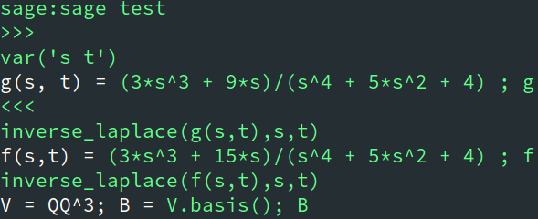
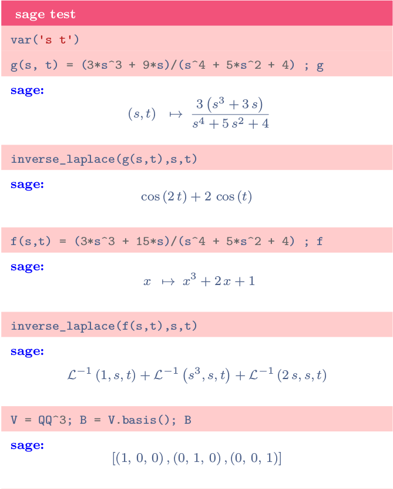

Optime
======

> A quick way to make notes and cheatsheet.

Still under testing !

## Prerequisites

- gawk >= 4.2.0
- SageMath (recommended)
- pygments (recommended)

## Headers

## Blocks

- column(s) block : `c`, `cc`, `ccc`, `cccc`.
- faq : `faq`
- plain text : `pt`
- code block : `code`
- bar chart : `bc`
- pie chart : `pie`
- timeline : `time`
- quotes : `quotes`
- sageMath block: `sage`

|Code|Screenshots|
|------|-------|
| |  |

## Options

### Define an option

### Options priority

<table>
  <tr> <td> Group </td>                          <td> Scope                 </td> </tr>
  <tr> <td rowspan = "5"> Sectionning </td>      <td> block                 </td> </tr>
                                            <tr> <td> subsubsection         </td> </tr>
                                            <tr> <td> subsection            </td> </tr>
                                            <tr> <td> section               </td> </tr>
                                            <tr> <td> part                  </td> </tr>
  <tr> <td rowspan = "3"> Global      </td>      <td> command line option   </td> </tr>
                                            <tr> <td> file option           </td> </tr>
                                            <tr> <td> configure file option </td> </tr>
</table>

### Available Options

#### Colors

 - headbackground  = "Orange!60!white"
 - footbackground  = "Orange!60!white"
 - textcolor       = "NavyBlue!60!black"
 - darkbackground  = "OrangeRed!70!white"
 - lightbackground = "red!20!white"
 - linkcolor       = "Blue"
 - citecolor       = "LimeGreen"
 - urlcolor        = "OrangeRed"

## TODO

- [ ] add unit test suite
- [ ] refactor code
- [ ] add credit 